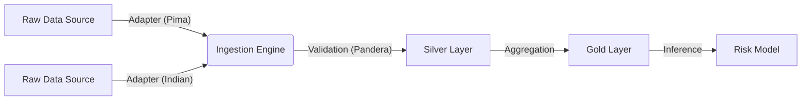

# Harmonized Clinical Data Pipeline for Metabolic Risk Stratification
[](https://github.com/heena5498/clinical-data-harmonizer/actions/workflows/data_check.yml)

A reproducible, automated framework for standardizing heterogeneous biomedical datasets.

This project implements a Software as a Medical Device (SaMD) prototype designed to harmonize disparate health data sources into a unified schema for downstream research and risk modeling. It focuses on data integrity, measurement reproducibility, and system automation.

---

## Project Goals

- **Engineer a Reproducible ETL**: Transform raw clinical data through a strict "Bronze → Silver → Gold" lineage to ensure traceability.
- **Ensure System Reliability**: Implement automated schema validation (CI/CD) to catch data anomalies before they impact analysis.
- **Harmonize Heterogeneous Data**: Standardize biological units (mg/dL vs. mmol/L) and demographic formats across international datasets (Pima Indians, Indian Healthcare).
- **Clinician-in-the-Loop Design**: Utilize configuration files (criteria.yaml) to allow non-technical stakeholders to adjust diagnostic thresholds without code changes.

> **Note**: This tool serves as a research prototype for data harmonization and educational risk estimation. It is not a certified diagnostic device.

---

##  Architecture: The "Adapter Pattern"

This system uses an Object-Oriented Adapter Pattern to ingest data from different sources while enforcing a strict "Silver" schema.



- **Bronze Layer**: Raw CSVs as received from the source (immutable).
- **Silver Layer**: Cleaned, validated, and harmonized data (canonical schema).
- **Gold Layer**: Merged datasets ready for ML training.

---

## Preliminary Analysis & Validation

To ensure measurement reproducibility, this pipeline validates the impact of cleaning logic on biological distributions.

### 1. Impact of Data Cleaning (Reproducibility Check)

Visualizing the distribution shift before and after harmonizing "biological zeros" (sensor errors) in the Pima dataset. This ensures that hardware artifacts do not bias downstream risk prediction.

### 2. Clinical Correlations

Exploratory analysis of the harmonized "Silver" data to verify expected biological relationships (e.g., Glucose vs. BMI vs. Blood Pressure).

---

## 🤖 System Reliability & Automation (CI/CD)

To support the requirements of an Automated Electrochemical Measurement System, this repository includes a Continuous Integration (CI) workflow.

- **Workflow**: `.github/workflows/data_check.yml`
- **Function**: Automatically triggers on every git push.
- **Validation**: Runs `src/validate.py` to ensure that any changes to the code do not break the strict biological constraints defined in the schema (e.g., BMI must be > 5, Glucose must be positive).

---

## Repository Structure

```plaintext
diabetes-risk/
├─ .github/
│  └─ workflows/
│     └─ data_check.yml        # CI/CD Automation for reliability
├─ config/
│  ├─ registry.yaml            # Dataset registry (source paths)
│  ├─ criteria.yaml            # Configurable diagnostic thresholds
├─ data/                       # Bronze (Raw) -> Silver (Clean) -> Gold (Merged)
├─ figures/                    # Analysis plots for reporting
├─ src/
│  ├─ adapters/                # ADAPTER PATTERN IMPLEMENTATION
│  │  ├─ base.py               # Abstract Base Class (Enforces Interface)
│  │  ├─ indians.py            # Logic for Indian Healthcare data
│  │  └─ pima.py               # Logic for Pima Indians data
│  ├─ ingest.py                # CLI Entry point
│  ├─ labeling.py              # Logic for deriving medical labels
│  ├─ utils.py                 # Unit conversion & cleaning utilities
│  └─ validate.py              # Pandera Schema Validation
├── tests/                     
│   ├── __init__.py
│   └── test_adapters.py
├─ generate_prelim_figures.py  # Script for reproducibility
├─ requirements.txt  
└─ README.md

```

---
## Usage

### 1. Setup

```bash
# Clone and install dependencies
git clone https://github.com/yourusername/diabetes-risk.git
pip install -r requirements.txt
```

### 2. Run the Ingestion Pipeline

Use the CLI tool to process specific datasets. The system automatically selects the correct Adapter based on the registry.

```bash
# Process Pima Indians dataset (Bronze -> Silver)
python -m src.ingest silver pima

# Process Indian Healthcare dataset (Bronze -> Silver)
python -m src.ingest silver indians
```

### 3. Validate Data Integrity

Run the schema checks manually (also runs automatically via GitHub Actions).

```bash
python -c "from src.validate import validate_silver; print('Schema Validation Modules Loaded')"
```

---
## Technical Highlights

- **Pandera**: Used for runtime schema validation to enforce biological constraints (e.g., `Check.ge(0)`).
- **Typer**: Powers the CLI for easy interaction.
- **Abstract Base Classes (ABC)**: `src/adapters/base.py` ensures that any new dataset added in the future follows the exact same API, ensuring system scalability.
- **Unit Harmonization**: `src/utils.py` contains logic to detect and convert units, handling the mg/dL vs mmol/L difference standard in international research.

---

##  Contact

**Project Lead**: Heena Khan  
Open to research collaboration and internship opportunities in Biomedical Informatics.